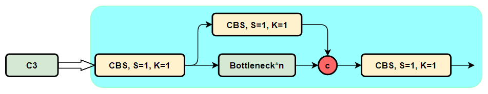
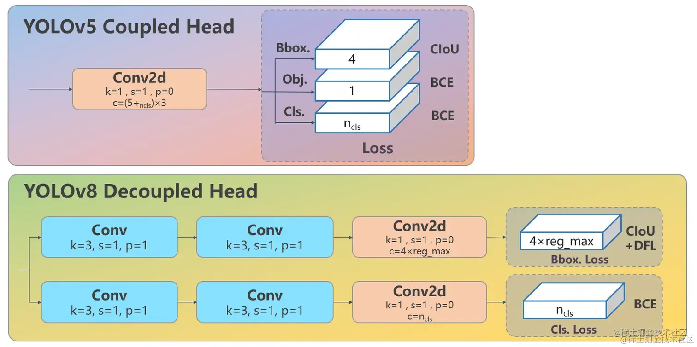
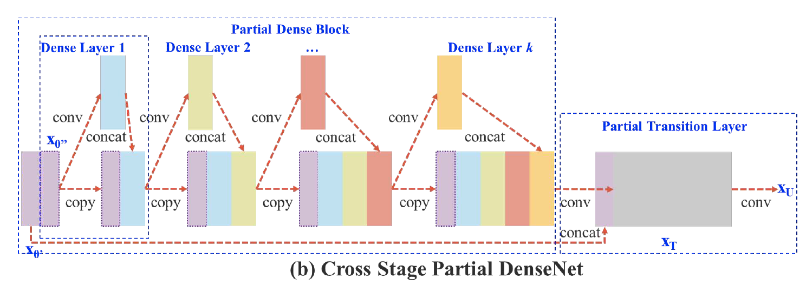
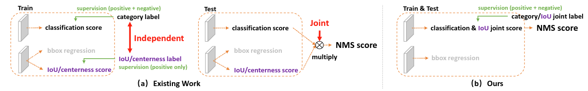
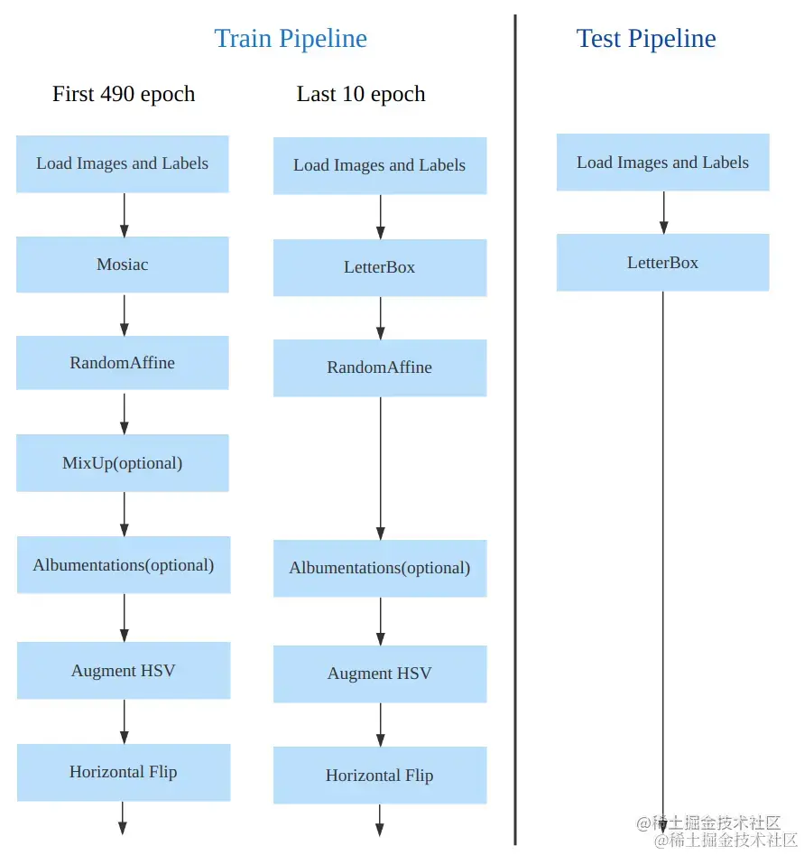

# YOLO系列介绍
## 性能比较
YOLOv8 相比 YOLOv5 精度提升非常多，但是 N/S/M 模型相应的参数量和 FLOPs 都增加了不少

| 模型 | YOLOv5 | params**(M)** | FLOPs**@640 (B)** | YOLOv8 | params**(M)** | FLOPs**@640 (B)** |
| :----: | :----: | :----: | :----: | :----: | :----: | :----: |
| n | 28.0(300e) | 1.9 | 4.5 | 37.3(500e) | 3.2 | 8.7 |
| s | 37.4(300e) | 7.2 | 16.5 | 44.9(500e) | 11.2 | 28.6 |
| m | 45.4(300e) | 21.2 | 49.0 | 50.2(500e) | 25.9 | 78.9 |
| l | 49.0(300e) | 46.5 | 109.1 | 52.9(500e) | 43.7 | 165.2 |
| x | 50.7(300e) | 86.7 | 205.7 | 53.9(500e) | 68.2 | 257.8 |

## 模型概述
### yolov8
1. 提供了一个全新的 SOTA 模型，包括 P5 640 和 P6 1280 分辨率 的目标检测网络和基于 YOLACT 的实例分割模型。和 YOLOv5 一样，基于缩放系数也提供了 N/S/M/L/X 尺度的不同大小模型，用于满足不同场景需求
2. 骨干网络和 Neck 部分可能参考了 YOLOv7 ELAN 设计思想，将 YOLOv5 的 C3 结构换成了梯度流更丰富的 C2f 结构，并对不同尺度模型调整了不同的通道数，属于对模型结构精心微调，不再是无脑一套参数应用所有模型，大幅提升了模型性能。不过这个 C2f 模块中存在 Split 等操作对特定硬件部署没有之前那么友好了
3. Head 部分相比 YOLOv5 改动较大，换成了目前主流的解耦头结构，将分类和检测头分离，同时也从 Anchor-Based 换成了 Anchor-Free
4. Loss 计算方面采用了 TaskAlignedAssigner 正样本分配策略，并引入了 Distribution Focal Loss
5. 训练的数据增强部分引入了 YOLOX 中的最后 10 epoch 关闭 Mosiac 增强的操作，可以有效地提升精度

## 模型结构
### yolov5

#### C3模块
包含3个标准卷积和多个Bottleneck模块  

模块代码如下  
```
class C3(nn.Module):
    """CSP Bottleneck with 3 convolutions."""

    def __init__(self, c1, c2, n=1, shortcut=True, g=1, e=0.5):
        """Initialize the CSP Bottleneck with given channels, number, shortcut, groups, and expansion values."""
        super().__init__()
        c_ = int(c2 * e)  # hidden channels
        self.cv1 = Conv(c1, c_, 1, 1)
        self.cv2 = Conv(c1, c_, 1, 1)
        self.cv3 = Conv(2 * c_, c2, 1)  # optional act=FReLU(c2)
        self.m = nn.Sequential(*(Bottleneck(c_, c_, shortcut, g, k=((1, 1), (3, 3)), e=1.0) for _ in range(n)))

    def forward(self, x):
        """Forward pass through the CSP bottleneck with 2 convolutions."""
        return self.cv3(torch.cat((self.m(self.cv1(x)), self.cv2(x)), 1))
```
#### Bottleneck模块
1. 先将channel 数减小再扩大（默认减小到一半），具体做法是先进行1×1卷积将channel减小一半，再通过3×3卷积将通道数加倍，并获取特征（共使用两个标准卷积模块），其输入与输出的通道数是不发生改变的
2. shortcut参数控制是否进行残差连接
3. 在yolov5的backbone中的Bottleneck都默认使shortcut为True，在head中的Bottleneck都不使用shortcut
4. 与ResNet对应的，使用add而非concat进行特征融合，使得融合后的特征数不变
模块代码如下  
```python
class Bottleneck(nn.Module):
    # Standard bottleneck
    def __init__(self, c1, c2, shortcut=True, g=1, e=0.5):  # ch_in, ch_out, shortcut, groups, expansion
        super(Bottleneck, self).__init__()
        c_ = int(c2 * e)  # hidden channels
        self.cv1 = Conv(c1, c_, 1, 1)
        self.cv2 = Conv(c_, c2, 3, 1, g=g)
        self.add = shortcut and c1 == c2

    def forward(self, x):
        return x + self.cv2(self.cv1(x)) if self.add else self.cv2(self.cv1(x))
```
### yolov8

#### backbone和neck
- 第一个卷积层的 kernel 从 6x6 变成了 3x3
- 所有的 C3 模块换成 C2f，结构如下所示，可以发现多了更多的跳层连接和额外的 Split 操作
- 去掉了 Neck 模块中的 2 个卷积连接层
- Backbone 中 C2f 的block 数从 3-6-9-3 改成了 3-6-6-3
- 查看 N/S/M/L/X 等不同大小模型，可以发现 N/S 和 L/X 两组模型只是改了缩放系数，但是 S/M/L 等骨干网络的通道数设置不一样，没有遵循同一套缩放系数。如此设计的原因应该是同一套缩放系数下的通道设置不是最优设计，YOLOv7 网络设计时也没有遵循一套缩放系数作用于所有模型

Head 部分变化最大，从原先的耦合头变成了解耦头，并且从 YOLOv5 的 Anchor-Based 变成了 Anchor-Free  
可以看出，不再有之前的 objectness 分支，只有解耦的分类和回归分支，并且其回归分支使用了 Distribution Focal Loss 中提出的积分形式表示法  
其结构如下所示：  


#### C2f模块
将yolov5中的C3模块换成梯度流更丰富的C2f模块  
csp模块的示意图如下：  

c2f实际上就是在csp模块前面多加了一个卷积，前后总共有两个卷积  
模块代码如下  
```python
class C2f(nn.Module):
    """CSP Bottleneck with 2 convolutions."""

    def __init__(self, c1, c2, n=1, shortcut=False, g=1, e=0.5):
        """Initialize CSP bottleneck layer with two convolutions with arguments ch_in, ch_out, number, shortcut, groups,
        expansion.
        """
        super().__init__()
        self.c = int(c2 * e)  # hidden channels
        self.cv1 = Conv(c1, 2 * self.c, 1, 1)
        self.cv2 = Conv((2 + n) * self.c, c2, 1)  # optional act=FReLU(c2)
        self.m = nn.ModuleList(Bottleneck(self.c, self.c, shortcut, g, k=((3, 3), (3, 3)), e=1.0) for _ in range(n))

    def forward(self, x):
        """Forward pass through C2f layer."""
        y = list(self.cv1(x).chunk(2, 1))
        y.extend(m(y[-1]) for m in self.m)
        return self.cv2(torch.cat(y, 1))

    def forward_split(self, x):
        """Forward pass using split() instead of chunk()."""
        y = list(self.cv1(x).split((self.c, self.c), 1))
        y.extend(m(y[-1]) for m in self.m)
        return self.cv2(torch.cat(y, 1))
```

## 损失计算
### yolov8
yolov8采用了动态分配正负样本策略 根据分类与回归的分数加权的分数选择正样本  
具体步骤为：  
计算真实框和预测框的匹配程度  
$$ align\_metric= s ^\alpha *u^\beta $$
其中，s是预测类别分值，u是预测框和真实框的ciou值，α和β为权重超参数，两者相乘就可以衡量匹配程度，当分类的分值越高且ciou越高时，align_metric的值就越接近于1,此时预测框就与真实框越匹配，就越符合正样本的标准  
对于每个真实框，直接对align_metric匹配程度排序，选取topK个预测框作为正样本  
对一个预测框与多个真实框匹配测情况进行处理，保留ciou值最大的真实框  

分类分支依然采用 BCE Loss  
$$L=\frac1N\sum_iL_i=\frac1N\sum_i-[y_i\cdot log(p_i)+(1-y_i)\cdot log(1-p_i)]$$
回归分支需要和 Distribution Focal Loss 中提出的积分形式表示法绑定，因此使用了 Distribution Focal Loss， 同时还使用了 CIoU Loss  
yolov8引入Anchor-Free的Center-based methods(基于中心点)后，模型从输出“锚框大小偏移量(offest)”变为"预测目标框左、上、右、下边框距目标中心点的距离(ltrb = left, top, right, bottom)"  
CIOU loss用以令锚框更加接近标签值的损失，在(IOU)交并比损失上加上了宽高比的判据，从而更好在三种几何参数：重叠面积、中心点距离、长宽比上拟合目标框  
单独的CIOU loss的目标为“预测一个绝对正确的值(标签值)”，在数学上可以看做是一种“狄拉克分布”(一个点概率为无穷大，其他点概率为0),如果把标签认为是"绝对正确的目标"，那么学习出的就是狄拉克分布，概率密度是一条尖锐的竖线。然而真实场景，物体边界并非总是十分明确的  
为配合Anchor-Free、以及提升泛化性，增加了DFL损失，DFL以交叉熵的形式，去优化与标签y最接近的一左一右2个位置的概率，  


**Generalized Focal Loss**  
之前面临的问题：  
1. 类别分数和框的质量分数分开训练 不够端到端

2. 坐标框回归的方式不够灵活 没有办法建模复杂场景下的情况 希望用一种general的分布去建模边界框的表示

对于第一个问题，为了保证training和test一致，同时还能够兼顾分类score和质量预测score都能够训练到所有的正负样本，将两者的表示进行联合。从物理上来讲，我们依然还是保留分类的向量，但是对应类别位置的置信度的物理含义不再是分类的score，而是改为质量预测的score  
对于第二个问题，我们选择直接回归一个任意分布来建模框的表示。当然，在连续域上回归是不可能的，所以可以用离散化的方式，通过softmax来实现即可  

**Focal Loss**  
为了解决单阶段目标检测场景存在的前景类和背景类之间的极端不平衡，缩放因子在训练期间自动降低简单示例的贡献，并且快速将模型集中在困难的例子上  
$$
\text{FL}(p) = -(1 - p_t)^\gamma \log(p_t), \quad p_t = \begin{cases} 
p, & \text{when } y = 1 \\ 
1 - p, & \text{when } y = 0 
\end{cases}
$$

**Quality Focal Loss**  
为了将定位和分类联合，y表示训练期间预测边界框与其相应的地面实况边界框之间的 IoU 分数，动态值为 0∼1  
采用 sigmoid 运算符 σ(·) 的多重二元分类来进行多类实现  
由于不平衡问题仍在存在，需要在Focal Loss基础上进行扩展，使支持连续标签  
（1）将交叉熵部分 − log(pt) 扩展为其完整版本 −((1 − y) log( 1 − σ) + y log(σ)); (2) 比例因子部分 (1 − pt)γ 被推广为估计 σ 与其连续标签 y 之间的绝对距离，即 |y − σ|β (β ≥ 0)  
完整的公式如下  
$$
\text{QFL}(\sigma) = -|y - \sigma|^\beta \left( (1 - y) \log(1 - \sigma) + y \log(\sigma) \right).
$$
参数 β 控制权重降低率（实验得到 β = 2 最合适）  

**Distribution Focal Loss** 

3个Loss 采用一定权重比例加权即可  

## 数据增强和训练策略
### yolov8
最后 10 个 epoch 关闭 Mosaic 的操作  


训练参数如下  
| 配置项                 | 参数值                         |
|-----------------------|-------------------------------|
| optimizer             | SGD                           |
| base learning rate    | 0.01                          |
| base weight decay     | 0.0005                        |
| optimizer momentum    | 0.937                         |
| batch size            | 128                           |
| learning rate schedule| linear                        |
| training epochs       | 500                           |
| warmup iterations     | max(1000, 3 * iters_per_epoch)|
| input size            | 640x640                       |
| EMA decay             | 0.9999                        |


